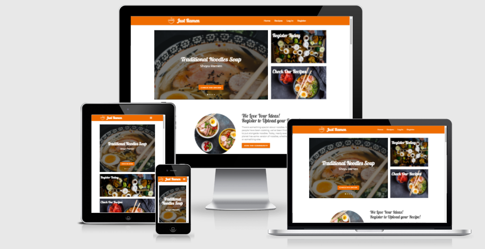

<h1 align="center">Just Ramen Website</h1>

[View the live project here.](https://ms3-online-cookbook.herokuapp.com/)

This is the Just Ramen website. It is designed to be responsible and accessible on multiple devices, making it easy to navigate for users on every device.

<h2 align="center"></h2>

## User Experience (UX)

### Project Goals

The site's primary goal is to help the visitors making great ramen bowls and inspire them to upload and share their own creations with the community. The business goal is to sell the recipe book to the website's audience. The site has three target audience and an admin role:

- Guest users (first time visitors)
- Contributors (people who are subscribed and registered to the website)
- Customers (people who like the recipes and want to purchase the book)
- Admin (can edit/remove the categories and all the recipes)


### User stories

  - ### Guest User Goals

    1. As a Guest User, I want to find easily the recipes.
    2. As a Guest User, I want to browse all recipes and use the search function.
    3. As a Guest User, I want to explore the recipe page, check the comments and how many likes the recipe has.
  

  - ### Contributors Goals

    1. As a Contributor, I want to add likes and comments to the recipes.
    2. As a Contributor, I want to upload my own recipes and share them with the community.
    3. As a Contributor, I want to edit my recipes or delete them.
    4. As a Contributor, I want to edit my preferences on my profile page, like email, user image.
    5. As a Contributor, I want to find community links.
  

  - ### Customers Goals

    1. As a Customer, I want to find the purchase link for the recipe book.
    2. As a Customer, I want to find the email address to contact the staff.
    3. As a Customer, I want to subscribe to the newsletter to see the offers and new products.
  

### UX - Five Planes Method

#### 1. Strategy
  The primary goal is to help the users making great ramen bowls and inspire them to upload and share their own creations with the community. The business goal is to sell the recipe book to the website's audience, and add more products over time.
  
#### 2. Scope
  Everything should be easy to understand. There is a simple navigation bar. The user should be able to register, sign in, see a recipe, add a like and/or a comment, edit the profile and add new recipes.

#### 3. Structure
  There is a home page which feature a great number or recipes, divided by categories, a callout to register, a subribe reminder and a link to purchase the recipe book. There is the page "Recipes" with all recipes and each recipe has an individual page with its details, picture, ingredients, preparation steps, and comments. The other main page is the user page, where it is possible to edit the user details, upload a new recipe and manage the other recipes.

#### 4. Skeleton
  There is a base template that is used for the navbar and the footer. Other templates are loaded into the main section of the base template for the home, recipe, user, login, register, edit pages. Each page have a different layout with common recurring elements. Check the wireframes for more details.

#### 5. Surface
  The website has a simple design with a few elemnts. The predominant color is orange and the font style is handwritten. Check the design section for more details.

### Design

#### Colour Scheme

- The palette has been generated with [Coolors](https://coolors.co/)


  - Black: #000000
  - Spanish Orange: #ef6c00
  - Persian Green: #26a69a
  - Cultured: #f6f5f3
  - White: #ffffff

#### Typography

- "Montserrat" is the main font used throughout the whole website, with Sans Serif as the fallback font in case for any reason the font isn't being imported into the site correctly.
- "Pattaya" is a clean font used for headings.

#### Imagery
- Imagery is important. The images are all high quality pictures, designed to be striking and catch the user's attention. It also has a modern, energetic aesthetic.

### Wireframes

- Home Page - Desktop Wireframe - [View](static/doc/home_desktop.png)
- Home Page - Tablet Wireframe - [View](static/doc/home_tablet.png)
- Home Page - Mobile Wireframe - [View](static/doc/home_mobile.png)

- Recipe Page - Desktop Wireframe - [View](static/doc/recipe_desktop.png)
- Recipe Page - Tablet Wireframe - [View](static/doc/recipe_tablet.png)
- Recipe Page - Mobile Wireframe - [View](static/doc/recipe_mobile.png)

- Profile Page - Desktop Wireframe - [View](static/doc/profile_desktop.png)
- Profile Page - Tablet Wireframe - [View](static/doc/profile_tablet.png)
- Profile Page - Mobile Wireframe - [View](static/doc/profile_mobile.png)

## Features

- Responsive on all device sizes
- Interactive form controls
- Button hover animations
- Modal used to add a new recipe and category
- Add likes and comments to the recipes
- User Sign In/Sign Up
- Edit user informations
- Upload new recipes feature
- Default images for users and recipes
- Random suggestions in each recipe page
- Search function

### Features Left to Implement

- Users management
- More filter to improve the search function

## Technologies Used

### Languages Used

- [HTML5](https://en.wikipedia.org/wiki/HTML5)
- [CSS3](https://en.wikipedia.org/wiki/Cascading_Style_Sheets)
- [JavaScript](https://en.wikipedia.org/wiki/JavaScript)
- [Python](https://en.wikipedia.org/wiki/Python_(programming_language))

### Frameworks, Libraries & Programs Used

**Front-End**
* [Materialize](https://materializecss.com/) 
* [Font-Awesome](https://fontawesome.com/)
* [Google Fonts](https://fonts.google.com/)
* [jQuery](https://jquery.com/)
* [Balsamiq](https://balsamiq.com/)
* [Paint.net](https://www.getpaint.net/)

**Back-end**
* [Flask](https://flask.palletsprojects.com/en/1.1.x/)
* [Jinja](https://jinja.palletsprojects.com/en/2.11.x/)
* [MongoDB](https://www.mongodb.com/1)
* [Werkzeug](https://werkzeug.palletsprojects.com/en/1.0.x/)

**Deployment**
* [Heroku](https://dashboard.heroku.com/)
* [Git](https://git-scm.com/)
* [Github](https://github.com/)
* [Gitpod](https://gitpod.io/)

**Testing**
* [JSHint](https://jshint.com/) (JS file passed validator)
* [PEP8 online](http://pep8online.com/)
* [W3C HTML Validator](https://validator.w3.org/) (all pages passed validator)
* [W3C CSS Validator](https://jigsaw.w3.org/css-validator/) (css file passed validator)

## Testing

The W3C Markup Validator and W3C CSS Validator Services were used to validate every page of the project to ensure there were no syntax errors in the project.

- [W3C Markup Validator](https://jigsaw.w3.org/css-validator/#validate_by_input) - [Results](assets/doc/html-valid.png)
- [W3C CSS Validator](https://jigsaw.w3.org/css-validator/#validate_by_input) - [Results](assets/doc/css-valid.png)
- [Esprima JS Validator](https://esprima.org) - [Results](assets/doc/js-valid.png)

The deployed site was tested with Lighthouse for performance evaluation and with Responsinator for responsiveness.

- [Lighthouse](https://developers.google.com/web/tools/lighthouse) - [Results](assets/doc/lighthouse.png)

  

- [Responsinator](http://www.responsinator.com/) - [Results](http://www.responsinator.com/?url=https%3A%2F%2Fms3-online-cookbook.herokuapp.com%2F)

### Testing User stories from User Experience (UX) Section

- #### Guest User Goals

  - As a Guest User, I want to find easily the recipes.
    1. Upon entering the site, users can immediately wiew a few recipes in carousel, and click the callout button.
    2. The home page provide a great variety of recipes divided by categories.

  - As a Guest User, I want to browse all recipes and use the search function.
    1. In the home page there are multiple links to the recipes page.
    2. In the navbar there is the link to visit the recipes page.
    3. In the recipes page there is the search bar.

  - As a Guest User, I want to explore the recipe page, check the comments and how many likes the recipe has.
    1. Each recipe has its own page.
    2. In the recipe page there is the number of likes in the heading next to the recipe name. The comments are in a section below the recipe steps.

- #### Contributors Goals

  - As a Contributor, I want to add likes and comments to the recipes.
    1. A logged user can add/remove a like to a recipe with the same button in the recipe page.
    2. A logged user can leave a comment on a recipe.

  - As a Contributor, I want to upload my own recipes and share them with the community.
    1. A logged user can upload a new recipe on the website and other users can like or comment it.

  - As a Contributor, I want to edit my recipes or delete them.
    1. In the profile page there is the list of personal recipes, and the user can edit or delete them.
  
  - As a Contributor, I want to edit my preferences on my profile page, like email, user image.
    1. In the profile page it is possible to edit the preferences.
  
  - As a Contributor, I want to find community links.
    1. In the footer the user can find the the social links.

- #### Customers Goals

  - As a Customer, I want to find the purchase link for the recipe book.
    1. In the home page there is a section dedicated to the recipe book, and the purchase link.

  - As a Customer, I want to find the email address to contact the staff.
    1. In the footer the user can find the contact email address
    2. The user can contact the staff about improvements on the website or the book.

  - As a Customer, I want to subscribe to the newsletter to see the offers and new products.
    1. The user can subscribe to the newsletter in the dedicated home page section.
    2. The is no need of registration to subscribe to the newsletter.

### Further Testing

- The Website was tested on Google Chrome, Firefox and Microsoft Edge.
- The website was viewed on a variety of devices such as Desktop, Laptop, iPhone7, iPhone 8 & iPhoneX, iPad.
- A large amount of testing was done to ensure that all pages were linking correctly.

### Solved Bugs

- It wasn't possible to have multiple buttons on the carousel. Solved with javascript:

```
function changeLinkToButton() {
    href = $(".carousel-item.active").attr("href");
    $("#carousel-button").attr("href", href)
}
```

- Use render_template send the same POST request ad each page refresh, solved with a redirect:

```
return redirect(url_for("get_categories"))
```

- Request.form.get() doesn't get an array. Solved using:
```
ingredient_list = request.form.getlist("ingredient_list[]")

```

# Deployment

***Requirements to deploy:***

- An IDE: I used Gitpod but will use a IDE that is not online for my next project. I choose Gitpod as this is the recommended IDE at Code Institute.
- Python3: In order to to run the application and use Flask.
- PIP3: To install all application imports (such as Flask and OS).
- A template folder: To link with the app routes.
- A database: I choose MongoDB Atlas. 


## Local Deployment

* Open browser of choice.
* Copy/Paste the address of [**Just Ramen repository**](https://github.com/tizianocoppoli/ms3-online-cookbook) in your search box.
* When on the page, click on the "Code" button.
* Copy the the |**HTTPS link**](https://github.com/tizianocoppoli/ms3-online-cookbook.git).
* Open your IDE and in your terminal, create a virtual environement supporting python and flask and activate it.
* Type "git clone" and paste the [**HTTPS Link**](https://github.com/tizianocoppoli/ms3-online-cookbook.git).
* Create an environement file called "env.py" and add :
    - MONGO_URI=mongodb+srv://...
    - SECRET_KEY= [Your Secret key]
* Add your env.py to .gitignore. to avoid it being uploaded.
* In app.py, switch **debug=False** to **debug=True**
* Upgrade pip locally with the command "pip install -U pip".
* Install the modules used to run the application.
* In parallel, create a MongoDB account and create a database called **"online_cookbook"**.
* These are the following collections in the database:

***categories***
```
_id:<ObjectId>
category_name:<string>
category_description:<string>
```

***contacts***
```
_id:<ObjectId>
email_address:<string>
```

***users***
```
_id:<ObjectId>
username:<string>
password:<string>
user_img:<string>
email:<string>

```

***recipes***
```
_id:<ObjectId>
category:<string>
recipe_name:<string>
is_spicy:<string>
is_vegan:<string>
created_by:<string>
ingredient_list:<array>
recipe_steps:<array>
recipe_img:<string>
preparation_time:<string>
servings:<string>
difficulty:<string>
likes:<integer>
like_array:<array>
comment_array:<array>
```

* You can now run your application locally by typing the command "python3 app.py" or "run app.py" in your terminal.

## Deploying on Heroku<hr>

- Create a requirements.txt file using the command **pip3 freeze --local > requirements.txt** in your CLI.
- Create a Procfile (always with an uppercase P) through the command **echo web: python app.py > Procfile**. Commit and Push.
- Create an account on [**Heroku**](https://www.heroku.com/home).
- Create a new app with **unique name**.
- Select your **nearest region**.
- Create a **new python project** within the project.
- Link that project through your **Github repository** in the **deployment** section.
- Navigate to Haroku Settings and set up the following in **Config Vars**

```
_IP = 0.0.0.0
MONGO_DBNAME = [Name of DB]
MONGO_URI = mongodb+srv://:@<cluster_name>-qtxun.mongodb.net/<database_name>?retryWrites=true&w=majority
PORT = 5000
SECRET_KEY = [Your Secret key]

```
* Go back to the Deploy section, select the master branch and deploy the project. 

## Credits

### Code

- [Materialize](https://materializecss.com/): CSS library used throughout the project mainly to make the site responsive using the grid system.

### Content

- All content was written by the developer.
- Psychological properties of colours text in the README.md was found [here](http://www.colour-affects.co.uk/psychological-properties-of-colours)

### Media

- Pictures: [Canva](https://canva.com/)
- Editing is made by the developer.

### Acknowledgements

- My Mentor for continuous helpful feedback.
- Tutor support at Code Institute for their support.
